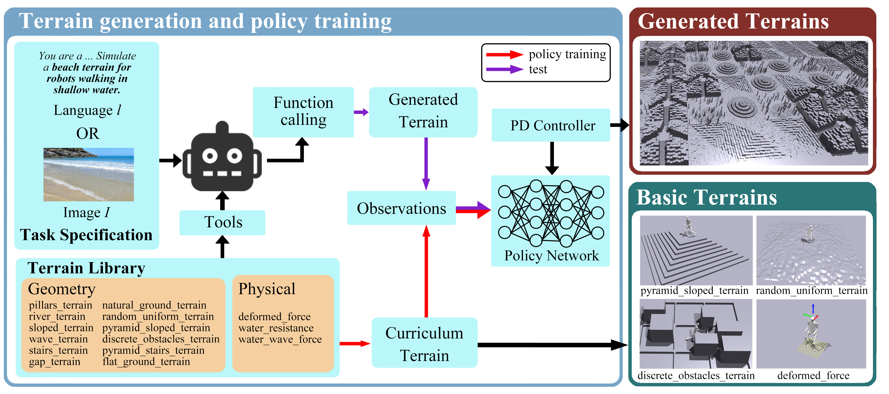

# GenTe

Code and benchmark release for paper: GenTe: Generative Real-world Terrains for General Legged Robot Locomotion Control.
arXiv：https://arxiv.org/abs/2504.09997


## 📖 Abstract

<p>
Developing bipedal robots capable of traversing diverse real-world terrains presents a fundamental robotics challenge, as existing methods using predefined height maps and static environments fail to address the complexity of unstructured landscapes. To bridge this gap, we propose GenTe, a framework for generating physically realistic and adaptable terrains to train generalizable locomotion policies. GenTe constructs an atomic terrain library that includes both geometric and physical terrains, enabling curriculum training for reinforcement learning-based locomotion policies. By leveraging function-calling techniques and reasoning capabilities of Vision-Language Models (VLMs), GenTe generates complex, contextually relevant terrains from textual and graphical inputs. The framework introduces realistic force modeling for terrain interactions, capturing effects such as soil sinkage and hydrodynamic resistance. To the best of our knowledge, GenTe is the first framework that systemically generates simulation environments for legged robot locomotion control. Additionally, we introduce a benchmark of 100 generated terrains. Experiments demonstrate improved generalization and robustness in bipedal robot locomotion.
</p>




## 🔨 Installation

- Clone this repositary with:

```
git clone https://github.com/HaronW/GenTe.git
```

- Create environment with:

```
conda create -n GenTe python==3.10
conda activate GenTe
```

- To set up the environment, follow the instructions provided in the [legged_gym](https://github.com/leggedrobotics/legged_gym) project and arrange the project structure as follows.

- For terrain generation, execute the following commands to install the required dependencies:

```bash
conda install transformers
```


## 📂 Project Structure


```
GenTe
├── GenTe
│   ├── dataset
│   ├── resources
│   ├── legged_gym
│   ├── utils
├── generate_dataset.py
├── isaacgym
├── rsl_rl
└── README.md
```


## 📊 Benchmark Overview 

Our dataset comprises 200 samples in total: 
- **100 samples** from image inputs.
- **100 samples** from text inputs.

The dataset is categorized into two parts based on terrain generation methods:
- **Single Part**: Simulates terrains by stacking different terrains on the same part, providing a continuous challenge for robots.

- **Multiple Terrains**: Divides the map into multiple sections, allowing for the construction of distinct terrains on each part, offering varied challenges.

  


## 🚀 Testing

We have prepared several test terrains located in the directory `./GenTe/resources` for you to evaluate robot performance. 

To begin testing, you need to modify the configuration file at `./GenTe/legged_gym/envs/base/legged_robot_config.py`. To use terrains in our benchmark, try to edit config `load_terrain_dir` to the corresponding directory containing the disired numpy file. After making the necessary adjustments, navigate to the `scripts` folder and run the following command:

```bash
python train.py --task=h1
```


## 🌄 Terrain Generation

If you wish to create custom terrains based on your own specifications, follow these steps:

1. **Prepare Your Input**: Gather or design the terrain data you would like to use. For example, if image data is provided, use pre-defined two-phase generating function to generate terrains. If text data is provided, use one-phase generating function to generate terrains. 
2. **Edit the Terrain Generation Script**: Modify the code in `./GenTe/generate_images.py` to incorporate your custom terrains. Change the `url` and `api-key` to your url and api-key. Change the `path` to your data path. 
3. **Select Desired Terrains**: Choose the specific terrains you want to include in your experiments.


## Acknowledgements

We thank the authors of [legged_gym](https://github.com/leggedrobotics/legged_gym) and [unitree_rl_gym](https://github.com/unitreerobotics/unitree_rl_gym) for opening source their wonderful works.
